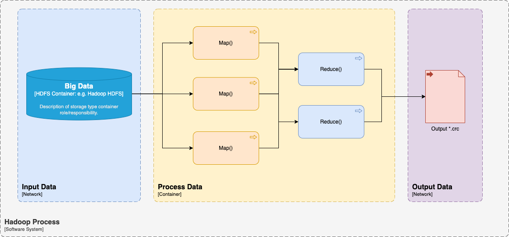

# Apache Hadoop MapReduce

Hadoop MapReduce is a software framework for easily writing applications which process vast amounts of data (multi-terabyte data-sets) in-parallel on large clusters (thousands of nodes) of commodity hardware in a reliable, fault-tolerant manner.

A MapReduce job usually splits the input data-set into independent chunks which are processed by the map tasks in a completely parallel manner. The framework sorts the outputs of the maps, which are then input to the reduce tasks. Typically both the input and the output of the job are stored in a file-system. The framework takes care of scheduling tasks, monitoring them and re-executes the failed tasks.

Typically the compute nodes and the storage nodes are the same, that is, the MapReduce framework and the Hadoop Distributed File System (see HDFS Architecture Guide) are running on the same set of nodes. This configuration allows the framework to effectively schedule tasks on the nodes where data is already present, resulting in very high aggregate bandwidth across the cluster.

The MapReduce framework consists of a single master ResourceManager, one worker NodeManager per cluster-node, and MRAppMaster per application (see YARN Architecture Guide).

Minimally, applications specify the input/output locations and supply map and reduce functions via implementations of appropriate interfaces and/or abstract-classes. These, and other job parameters, comprise the job configuration.

The Hadoop job client then submits the job (jar/executable etc.) and configuration to the ResourceManager which then assumes the responsibility of distributing the software/configuration to the workers, scheduling tasks and monitoring them, providing status and diagnostic information to the job-client.



## Inputs and Outputs

The MapReduce framework operates exclusively on <key, value> pairs, that is, the framework views the input to the job as a set of <key, value> pairs and produces a set of <key, value> pairs as the output of the job, conceivably of different types.

The key and value classes have to be serializable by the framework and hence need to implement the Writable interface. Additionally, the key classes have to implement the WritableComparable interface to facilitate sorting by the framework.

Input and Output types of a MapReduce job:

(input) <k1, v1> -> map -> <k2, v2> -> combine -> <k2, v2> -> reduce -> <k3, v3> (output)


## WordCount

Before we jump into the details, lets walk through an example MapReduce application to get a flavour for how they work.

WordCount is a simple application that counts the number of occurrences of each word in a given input set.

This works with a local-standalone, pseudo-distributed or fully-distributed Hadoop installation.

### TokenizerMapper
```
public class TokenizerMapper extends Mapper<Object, Text, Text, IntWritable> {

    private final static IntWritable INT_WRITABLE = new IntWritable(1);
    private Text word = new Text();

    public void map(Object key, Text value, Context context) throws IOException, InterruptedException {

        StringTokenizer stringTokenizer = new StringTokenizer(value.toString());

        while (stringTokenizer.hasMoreTokens()) {
            word.set(stringTokenizer.nextToken());
            context.write(word, INT_WRITABLE);
        }
    }
}
```

### IntSumReducer
```
public class IntSumReducer extends Reducer<Text, IntWritable, Text, IntWritable> {
    
    private IntWritable intWritable = new IntWritable();

    public void reduce(Text key, Iterable<IntWritable> values, Context context) throws IOException, InterruptedException {

        int sum = 0;

        for (IntWritable val : values) {
            sum += val.get();
        }

        intWritable.set(sum);

        context.write(key, intWritable);
    }
}
```

### WordCount

```
public class WordCount {

    public static void main(String[] args) throws Exception {

        String inputPath = args[0];
        String outPath = args[1];

        System.out.printf("Hadoop Word Counter within [%s] and [%s]%n", inputPath, outPath);

        Configuration configuration = new Configuration();

        Job job = new Job(configuration, "word count");
        job.setJarByClass(WordCount.class);

        job.setMapperClass(TokenizerMapper.class);
        job.setCombinerClass(IntSumReducer.class);
        job.setReducerClass(IntSumReducer.class);

        job.setOutputKeyClass(Text.class);
        job.setOutputValueClass(IntWritable.class);

        FileInputFormat.addInputPath(job, new Path(inputPath));
        FileOutputFormat.setOutputPath(job, new Path(outPath));

        System.exit(job.waitForCompletion(true) ? 0 : 1);
    }
}
```

### Input (*.txt)
```
Lorem ipsum dolor sit amet, consectetur adipiscing elit. Pellentesque molestie tortor velit, in luctus lacus ultrices a. Nulla facilisi. Maecenas diam risus, tincidunt a pellentesque ac, aliquam in sem. Integer eros risus, interdum et tincidunt eget, rhoncus vitae massa. Nam posuere commodo arcu in mattis. Mauris vulputate vitae ligula non ultrices. Nam commodo arcu erat, dapibus iaculis enim semper eu. Pellentesque habitant morbi tristique senectus et netus et malesuada fames ac turpis egestas. Quisque sed mollis massa. Mauris finibus dolor eget venenatis malesuada. Ut ex mi, scelerisque vel eros at, luctus commodo enim. Nunc maximus blandit pulvinar. Etiam ultricies iaculis aliquam. Maecenas molestie mi a metus elementum, scelerisque cursus ipsum facilisis. Nam porta erat vel tincidunt maximus.

Aliquam nec odio congue, elementum libero in, venenatis leo. Donec ut erat convallis, eleifend ipsum volutpat, aliquam lacus. Vestibulum odio arcu, faucibus nec justo a, luctus rhoncus felis. Vestibulum vehicula tempus sem faucibus maximus. In tristique interdum dolor, ut euismod metus blandit vitae. Pellentesque nec rutrum felis. Vestibulum malesuada dui massa, sed pretium erat auctor nec. Fusce aliquet consequat augue ut lacinia. Pellentesque aliquet ligula orci, sit amet malesuada nisl imperdiet quis. Phasellus tincidunt et turpis vel egestas.

...
```

### Run Application

```
mvn compile exec:java -Dexec.mainClass="de.microtema.WordCount" -Dexec.args="./target/classes/input.txt ./target/output/**/*.crc"
```

### Output (*.crc)
```
Aliquam	2
Cras	2
Curabitur	2
Donec	3
Duis	2
Etiam	4
Fusce	1
In	1
Integer	2
Lorem	1
Maecenas	3
...
```